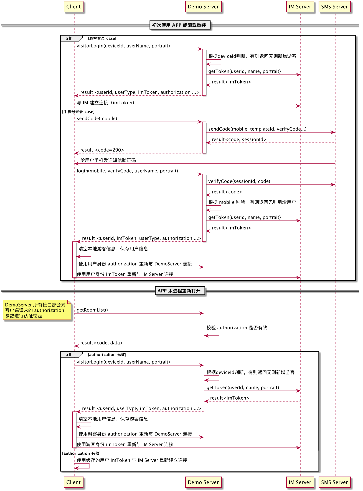

## 目录结构

* [关键模块代码说明](#1)
	* [demoServer 交互模块](#2)
	* [IM 交互模块](#3)
	* [RTC 交互模块](#4)
	* [房间模块](#5)
	* [房间模块 ViewModel(RCMicRoomViewModel) 详细说明](#6)

* [关键业务逻辑说明](#7)
	* [登录流程](#8) 
	* [加入房间流程](#9) 
	* [麦位相关状态改变流程](#10)
	* [观众转换为参会人员流程](#11)
	* [参会人员转为观众流程](#12)
	* [正在发言相关 KV 的处理流程](#13)
	* [主持人转让与接管流程](#14)

<h2 id='1'>关键模块代码说明</h2>

<h3 id='2'>demoServer 交互模块</h3>

* RCMicAppService 类负责，提供用户、房间、麦位、版本升级等模块所使用到的网络请求接口，详细使用方法及作用可查看头文件中的具体注释

<h3 id='3'>IM 交互模块</h3>

* RCMicIMService 类负责，对使用到的 IM SDK 相关接口进行统一封装并提供符合 demo 场景的 KV 存取相关接口，IM 聊天室相关功能可参考：[IM 聊天室](https://docs.rongcloud.cn/v3/views/im/noui/guide/chatroom/intro/framework.html)

<h3 id='4'>RTC 交互模块</h3>

* RCMicRTCService 类负责，对项目中使用到的 RTC SDK 相关接口进行统一封装，RTC 相关功能可参考：[低延迟直播](https://docs.rongcloud.cn/v3/views/rtc/livevideo/intro/ability.html)

<h3 id='5'>房间模块</h3>

| 目录 | 说明 |
|:---:|:---:|
| RCMicRoomViewController | 房间视图控制器，负责房间内各子视图的初始化、加载以及各模块之间 UI 上的交互 |
| ViewModel | 房间模块 ViewModel，负责房间中各视图的数据加载及处理 |
| HeaderFooter | 自定义顶部导航栏及底部工具栏 |
| Participants | 麦位模块 |
| Chat | 消息展示模块 |
| BottomDialog | 房间内各种弹窗 |
| InputBar | 输入工具栏 |
| RTCStatus | RTC 相关状态监控 |

<h3 id='6'>房间模块 ViewModel(RCMicRoomViewModel) 详细说明</h3>

* RCMicRoomViewModel 类主要负责 IM、RTC 层房间的创建销毁，消息的收发监听，音视频流的发布订阅以及根据聊天室 KV 的改变更新相关状态（上下麦、正在发言状态等）

* 麦位用户变更、麦位发言状态等信息的变更都是通过 IM 聊天室的 KV 存储来实现的，端上收到对应 KV 变更的消息后根据不同的 key 来更新不同的数据，demo 中用到的几种 Key 均在`RCMicIMService.h`文件中定义

* RCMicRoomViewModel.h，代码中标签划分的代码块说明：
	* UI 更新相关：提供 block 回调用于控制器及时更新相关 UI
	* 初始化及销毁：提供初始化及销毁接口
	* 房间相关：提供加入、退出、发布资源、同步麦位信息等房间相关接口
	* 消息相关：提供消息收发等处理接口
	* 麦位、主持人、非主持人相关：分别针对主持人身份和非主持人身份提供麦位操作的相关接口

* RCMicRoomViewModel.m，代码中标签划分的代码块说明：
	* Public method：RCMicRoomViewModel.h 中提供的相关方法的具体实现
	* Private method：主要包含 IM、RTC 相关数据加载及处理方法
	* 消息相关：监听 IM 接收到消息的相关回调，并根据不同的消息类型更新不同的区域
	* 麦位角色转换及更新相关：根据麦位的 KV 更新消息来处理角色的转换及音频流的发布订阅等
	* 发言状态相关：根据发言状态的 KV 更新来更新对应麦位的动画
	* 直播延迟相关：根据 RTC 回调的基础数据来计算所需数据并更新相关 UI

<h2 id='7'>关键业务逻辑说明</h2>

<h3 id='8'>登录流程</h3>



<h3 id='9'>加入房间流程</h3>

* 从房间列表进入的房间默认都是观众身份进入，只有从创建房间的入口进入时会以主持人身份进入

* 主持人
	* 根据房间 ID 先加入 IM 聊天室
	* 加入聊天室成功后加入 RTC 聊天室
	* 监听到 IM 聊天室 KV 同步完成后开始获取房间中的麦位及讲话状态等相关 KV 然后更新 UI，同时发布自己的音频流并且将发布后的直播地址更新到 KV 中

* 观众
	* 根据房间 ID 加入 IM 聊天室
	* 监听到 IM 聊天时 KV 同步完成后开始获取房间中的麦位及讲话状态等相关 KV 并更新 UI，同时如果发现 KV 中存在直播地址则订阅相关音频直播

<h3 id='10'>麦位相关状态改变流程</h3>

* 监听 IM 聊天室中的消息，如果是 KV 更新时发送的消息类型则根据具体更新的 Key 来分别进行下述处理
* 相关 key 的格式如下：

```
//直播流地址：
"liveUrl":"http://abc.com"

//麦位相关：
//最后的 0-8 表示九个麦位，0 为主持人
"sealmic_position_0":
	{
		"userId":"abcde",
		//0：正常状态（此时 userId 存在则说明麦位上有人，否则表示当前为空麦位），1:锁定状态（不允许上人），2:闭麦状态（当前麦位上的用户被禁言）
		"state":0,
		//0-8 表示九个麦位
		"position":0
	}

//正在发言相关:
//最后的 0-8 表示九个麦位，0 为主持人
"speaking_0":
	{
	//0 表示当前未发言，1 表示正在发言
	"speaking":0,
	//0-8 表示九个麦位
	"position":0
	}
	
//是否有人排麦相关：
//0 表示没人在排麦，1 表示有人在排麦
"applied_mic_list_empty":0
```


* 如果是 liveUrl 更新的 Key
	* 仅观众身份需要处理，如果已经订阅过且更新后的和之前订阅的相同不需要处理，没有订阅过或更新后和之前的不同则需要调用 RTC 接口重新订阅这次更新后的 liveUrl
* 如果是发言状态更新的 Key
	* 根据相关 KV 更新 UI 上指定麦位的动画状态即可

* 如果是排麦状态变更的 Key
	* 根据 KV 更新右上角小红点状态即可

* 如果是麦位相关更新的 Key
	* 根据具体的 KV 更新对应麦位的 UI
	* 根据更新前后同一麦位的状态改变来进行下述处理（下面只需要处理和自己相关的角色转化逻辑，麦位上非自己的其它用户有上麦下麦时需要做的订阅流操作在 RTC 房间变动相关的回调中进行处理）：

	```
	currentUserId //当前用户的 userId
	currentParticipantInfo //当前登录用户本地保存的麦位信息（如果有则说明当前用户在麦位上）
	currentRole //当前用户的角色（观众、普通麦位用户、主持人）
	newParticipantInfo //此次 KV 消息所携带的最新的麦位信息
	changeType //KV 中携带的相关类型说明
	
	//发生变化后麦位上的用户是自己时（表明此次变化后自己可能需要上麦或者根据麦位更新状态）
	if (newParticipantInfo.userId == currentUserId) {
		if(currentRole == 观众) {
			从观众转为参会者的操作
		}
		//当前用户不在麦位或者当前用户所在麦位的状态和新的麦位状态不匹配
		if（currentParticipantInfo == nil || currentParticipantInfo.state != 	newParticipantInfo.state）{
			根据新麦位的状态更新本地的麦克风状态（禁用或启用）
		}
		在本地保存的麦位信息改变前将所在麦位的发言状态手动设置为 NO 一次
		将本地保存的当前用户的麦位信息更新为新麦位的信息
	} else {
		//如果 changeType 不是 （4，5，6）中的一种并且当前用户的麦位信息存在（也就是当前用户在麦位上）并且新麦位的序号等于当前用户所在麦位序号时
		//说明发生变更的麦位是自己之前所持有的且变化后麦位上的人不是自己且此次变化类型不是双方在麦位互换身份（为了避免用户和主持人切换身份时频繁进行上下麦操作，麦位上互换身份时不做 RTC 层的上下麦处理），则需要进行下麦操作
		if(changeType != 4 && changeType != 5 && changeType != 6 && currentParticipantInfo != nil && 	currentParticipantInfo.position == newParticipantInfo.position) {
		从麦位用户转为观众的操作
		在本地保存的麦位信息改变前将所在麦位的发言状态手动设置为 NO 一次
		将本地保存的当前用户的麦位信息更新为新麦位的信息
		}
	}
	```

<h3 id='11'>观众转换为参会人员流程</h3>

* 取消订阅直播合流
* 取消成功后加入 RTC 房间内
* 加入 RTC 房间后订阅房间当前存在的所有音频流
* 加入 RTC 房间后发布自己的音频流
* 用 RTC 发布音频流后返回的 liveUrl 和从 KV 中获取到的 liveUrl 比对，如果不同则主动设置一次 KV 中的 liveUrl

<h3 id='12'>参会人员转为观众流程</h3>

* 退出 RTC 房间
* 退出成功后根据 liveUrl 地址订阅直播合流

<h3 id='13'>正在发言相关 KV 的处理流程</h3>

* 用户麦位状态改变时主动将当前麦位上发言状态的 KV 设置为 NO（避免上个麦位用户异常下麦导致这个麦位一直为发言状态）
* 监听 RTC 提供的 SDK 当前状态回调（此回调一秒会触发一次，省去自己写定时器了）
* 在回调中监听发出去的流状态
* 本地保存一下当前的发言状态
* 音量大于 0 则认为正在讲话，如果当前发言状态与本地保存的当前发言状态不相符则认为当前用户发言状态有变动，更新一次发言状态的 KV

<h3 id='14'>主持人转让与接管流程</h3>

#### 转让流程

* 主持人调用 server 接口，请求转让主持人
* 接口请求成功后主持人端弹出 loading 视图，15 秒（暂定）内收不到对方的响应则提示“对方未响应”并取消弹出层
* server 获知后会下发`RCMic:transferHostMsg`类型的自定义消息，消息中包含操作的发起者和接收者
* 房间内用户收到消息后根据自己当前的身份以及消息中携带的接收者判断自己是否被邀请接管主持人位置
* 如果自己是被邀请的一方则弹出提示框，让用户选择接受还是拒绝，两个操作都需要调用 server 接口反馈给 server
* server 获知结果后会再次下发一条`RCMic:transferHostMsg`消息，消息中包含此次被邀请用户的响应（同意还是拒绝）
* 主持人在 15 秒之内收到这条消息后就可以根据具体结果取消弹出层并提示用户了
* 超过 15 秒未收到对方响应则此次转让信息失效

#### 接管流程

* 接管流程和主持人转让流程大致形式一样，只是 server 下发的是`RCMic:takeOverHostMsg`类型的消息，其中的各个字段和之前的消息意义都类似
* 相关的界面操作也类似，只是变成了请求接管的一方弹出 loading 等待主持人的响应
