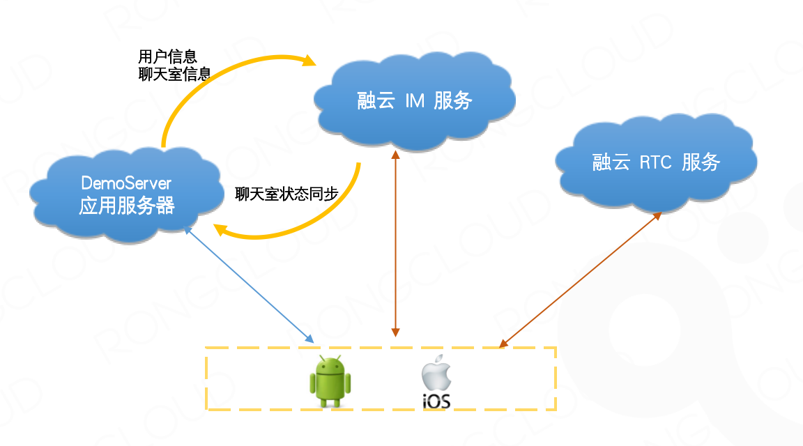

## 目录结构
* [项目说明](#1)  
* [前期准备](#2)  
* [代码运行](#3)
* [项目实体目录说明](#4)
* [详细开发文档](./Documents/开发文档.md)

<h2 id='1'>项目说明</h2>

* 此项目是基于融云所提供的 IM、RTC 相关能力所实现的语音聊天室场景下的示例 demo
* 整体架构：

<h2 id='2'>前期准备</h2>

* 需要到融云开发者后台注册并创建应用：[融云官网](https://www.rongcloud.cn)
* 创建应用后用获取到的 appkey 填到`RCMicMacro`文件中的`#define APPKey`对应位置
* 参考 demoServer 源码部署 SealMic 相关服务，部署完成后将服务地址填到`RCMicMacro `文件中的`#define BASE_URL`对应位置

<h2 id='3'>代码运行</h2>

* 进入到 Podfile 同级目录，终端执行`pod install`安装项目所依赖的第三方库
* 上述命令执行完毕后打开 SealMic.xcworkspace 项目即可运行

<h2 id='4'>项目实体目录说明</h2>

| 目录 | 子目录 | 子目录 | 说明 |
|:---:|:---:|:---:|:---:|
| main.m ||| 程序入口 |
| AppDelegate.h、AppDelegate.m||| 程序入口类 |
| Info.plist ||| 工程的配置信息 |
| Classes ||| 项目中所有代码 |
| Resources ||| 项目中用到的资源 |
| --- | --- | --- | --- |
| Classes | Sectionns || 不同业务模块功能类 |
| Classes | Sectionns | Login | 登录模块 |
| Classes | Sectionns | Room | 房间模块 |
| Classes | Sectionns | RoomCreate | 房间创建模块 |
| Classes | Sectionns | RoomList | 房间列表模块 |
| --- | --- | --- | --- |
| Classes | Service|| 与融云其它服务交互管理模块 |
| Classes | Service | Common | 项目中错误码汇总 |
| Classes | Service | App | 与 demoServer 交互管理类 |
| Classes | Service | IM | 与 IM 交互管理类 |
| Classes | Service | RTC | 与 RTC 交互管理类 |
| --- | --- | --- | --- |
| Classes | Util || 全局使用的一些工具类 |

